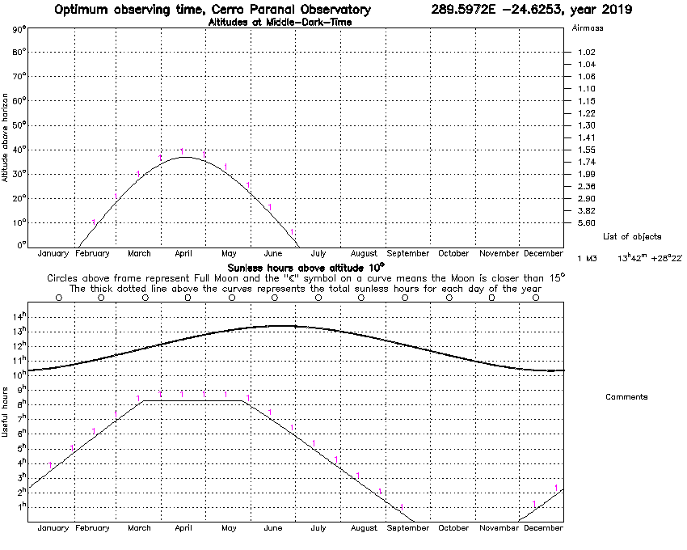
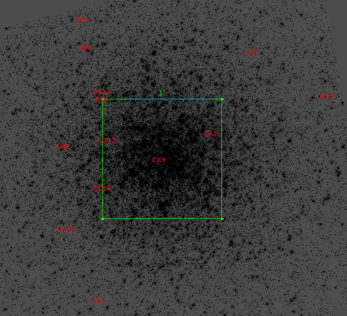
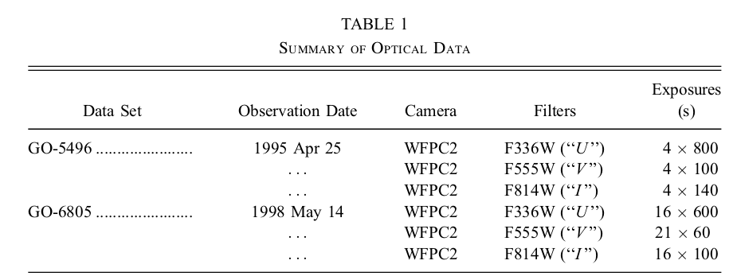
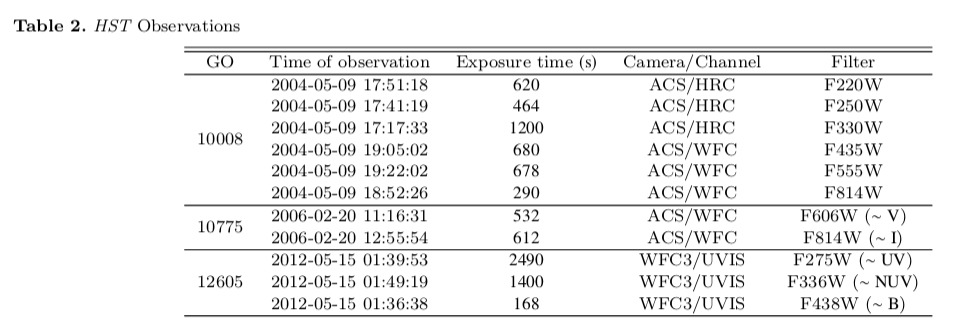
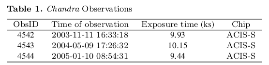

# M3 (NGC5272)

Coordinates:  13 42 11.62  +28 22 38.2 

Distance: 10.2 kpc

ID       [Fe/H] wt  E(B-V) V_HB (m-M)V V_t   M_V,t   U-B   B-V   V-R   V-I  spt   ellip
 
NGC5272    -1.50  7   0.01 15.64 15.07  6.19  -8.88   0.09  0.69        0.93  F6    0.04

## Star obs

## Sources

From  [Identifications of Faint ChandraSources in the GlobularCluster M3 Zhao et al. 2018](https://arxiv.org/pdf/1812.05130.pdf)

## MUSE data

No data taken by MUSE

## Hubble data

There is [Hugs](https://archive.stsci.edu/prepds/hugs/) data and this proposals:

From [Edmonds et al 2004.](https://iopscience.iop.org/article/10.1086/422136/pdf)

From [Zhao et al. 2018](https://arxiv.org/pdf/1812.05130.pdf)

## Chandra

From [Zhao et al. 2018](https://arxiv.org/pdf/1812.05130.pdf)

## References

- [Identifications of Faint Chandra Sources in the Globular Cluster M3 Zhao et al. 2018](https://arxiv.org/pdf/1812.05130.pdf)
