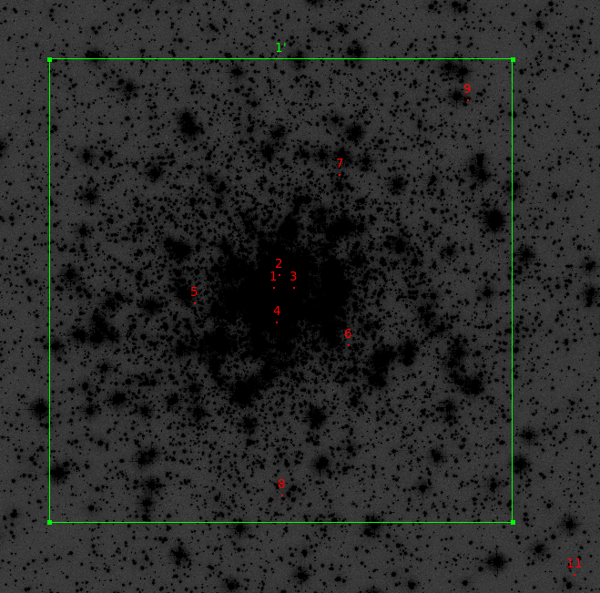

# M30 (NGC7099)

Coordinates: 21 40 22.12  -23 10 47.5

Distance: 10.2 kpc

ID       [Fe/H] wt  E(B-V) V_HB (m-M)V V_t   M_V,t   U-B   B-V   V-R   V-I  spt   ellip
 
NGC7099    -2.27  4   0.03 15.10 14.64  7.19  -7.45   0.03  0.60  0.41  0.86  F3    0.01

## Star obs

## X-ray sources

From [Chandra X-ray sources in the collapsed-core GB M30](https://ui.adsabs.harvard.edu/link_gateway/2007ApJ...657..286L/EPRINT_PDF)

Here is the info for those 9:

## Optical Counterpart candidates

## Hubble data

In 2004 Pietrukowicz and Kaluzny analyzed data from wfpc for M13, M30 and NGC 6712. 

This proposal [7379](https://archive.stsci.edu/proposal_search.php?mission=hst&id=7379) by Edmonds with WFPC23 in the filters F336Q, F55W and F814W  was to 'make a detailed study of binaries'

## MUSE data

It was observed three times  with MUSE. First in 2014, 2015 and 2018 with exposures time ranging from 200.00 to 300 seconds. In 2018 it was observed as part of the MUSE narrow-filed mode during commissioning.

## Hubble data

There is [Hugs](https://archive.stsci.edu/prepds/hugs/) data 

## References

- [Chandra X-ray sources iun the collapsed-core GB M30](https://ui.adsabs.harvard.edu/link_gateway/2007ApJ...657..286L/EPRINT_PDF)
- [Variable Stars in the Archival HST Data of Globular Clusters M13, M30 and NGC 6712](https://arxiv.org/abs/astro-ph/0403716)

