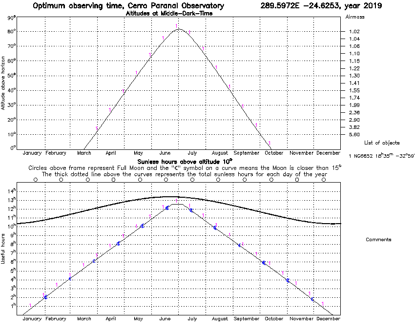
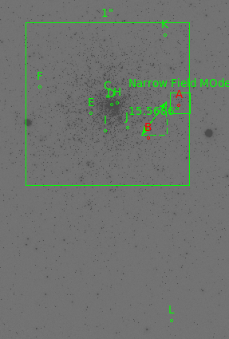
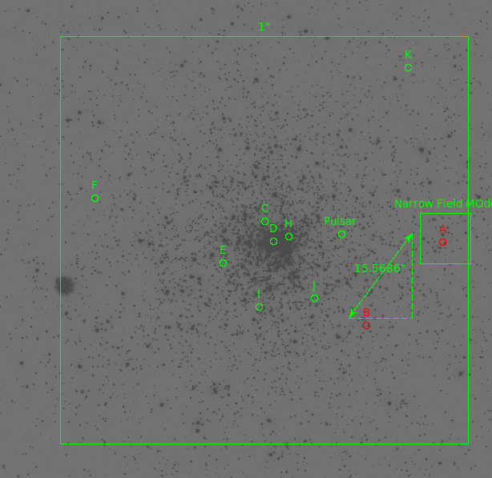
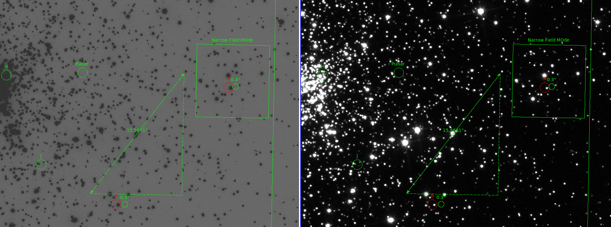
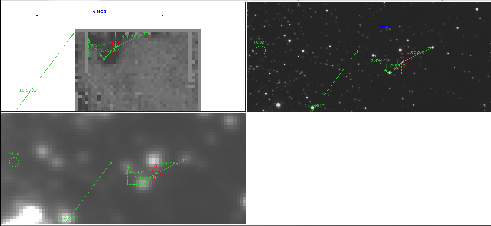

# NGC 6652

Altitude chance for NGC6652 from Cerro Paranal

## X-ray sources

## VIMOS data

Taken by Phil a while ago and couldn't find emmission from neither source B and A. The abstract doesnt seem to be available but the tittle is "Ultra-short Period X-ray binaries in the globular cluster NGC 6652"

## MUSE data

No muse data for NGC6652

## Pulsar

From [P Freire](http://www.naic.edu/~pfreire/GCpsr.html)

|Pulsars in NGC 6652|Offset(arcmin)|Period (a)  (ms)|dP/dt (a,b)  (10−20)|DM  (cm−3 pc)|Orbital Period (days)|x  (s)|Eccentricity|mc (c)  (M☉)|Notes|References|
|--- |--- |--- |--- |--- |--- |--- |--- |--- |--- |--- |
|J1835−3259A|*|3.889|*|63.35|9.2460|19.6(3)|0.968(5)|0.90|eccentric, massive, echange product|drk+15|

This is the reference :

- [A HIGHLY ECCENTRIC 3.9 MILLISECOND BINARY PULSAR IN THE GLOBULAR CLUSTER NGC 6652](https://iopscience.iop.org/article/10.1088/2041-8205/807/2/L23/pdf) byt DeCesar et al. 2015

## NGC 6652A

## NGC 6652B

# References

- [BeppoSAX study of the X-ray binary XV 1832-330 in NGC 6652](https://arxiv.org/pdf/astro-ph/0110480.pdf)

- [An examination of the X-ray sources in NGC 6652](https://arxiv.org/abs/1204.0552) by Stacey et al. 2012

- [A HIGHLY ECCENTRIC 3.9 MILLISECOND BINARY PULSAR IN THE GLOBULAR CLUSTER NGC 6652](https://iopscience.iop.org/article/10.1088/2041-8205/807/2/L23/pdf) byt DeCesar et al. 2015

- [Identification of the Low-Mass X-ray Binary and Faint X-ray Sources in NGC 6652](https://iopscience.iop.org/article/10.1086/323493/pdf)

 - [Ultraco,mp[act X-ray Binaries in GB: Variability of the Optical Counterpart of X1832-330 in NGC 6652](https://iopscience.iop.org/article/10.1086/312486)

- [The unusual X-ray binaries of NGC 6652](https://arxiv.org/pdf/1105.2975.pdf) byt Coomber et al. 2011

- [A 2.15 hour orbital Period for LMXB XB 1832-330 in NGC6652](https://arxiv.org/abs/1201.4131) 

## About NGC6652B

- Vlad Tudor wrote a VLA and [Chandra proposal](http://adsabs.harvard.edu/abs/2016cxo..prop.4880T) that Dr. Maccarone send me via email. 

